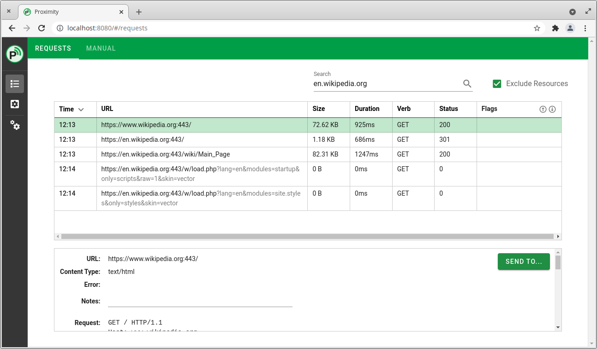

## Overview
Proximity is an intercepting proxy, allowing you to view and manipulate network requests between your web browser and the servers its communicating with. It is designed for web application penetration testing, but could be used for general debugging of applications, etc. It is similar in principle to mitmproxy or OWASP ZAP.

It takes the philosophy of do one thing, and do it well. The intent is not to pack in features which are rarely, if ever, used in practice. This is especially true where good quality standalone tools already exist.

This repository contains the core which proxies traffic, and exposes an API to interact with the captured traffic and perform other key functions. When compiled, it includes a web interface. The web interface is intended to be used for forward deployments, quick testing, or where the desktop interfaces won't otherwise run. It's not as polished as or as featureful as the dedicated desktop interface(s).



One of the reasons for developing this is to give back to the community. I want to help people who are new to pentesting, while still having 99% of what experienced pentesters need day to day.

Please only use this against applications that you have permission to test.

Feedback would be greatly appreciated.

## Installation
Download from the latest release from [https://github.com/pipeline/proximity-core/releases](https://github.com/pipeline/proximity-core/releases)

The Linux releases will require that you set the build to be executable from the directory: `chmod +x *`

For Linux then run `./run.sh -project PROJECT_FILENAME` for other platforms run: `./proximitycore -project PROJECT_FILENAME`

## Development/build instructions

### Building
Ensure dependencies (below) have been met.

After checking out the repository, you'll need to retrieve the code for the HTML frontend with:
```
git submodule init
git submodule update
```

You can then cd into the html_frontend directory and run ```./build.sh``` to build the frontend.

Then to build the main core, from the root directory of the project run ```./scripts/build.sh```

If you're going to be running a development build, then will also need to copy the pythoninterpreter executable and the python310 dependency directory (generated as part of the build script) into the working directory.

### General Dependencies:
  * golang (above 1.16) https://golang.org/doc/install
  * swaggo (```go install github.com/swaggo/swag/cmd/swag```)
      > You may need to ensure that the go bin directory is in your path. On Unix, you can add ```export PATH=$PATH:~/go/bin``` to your .bashrc or similar.
  * npm for the HTML frontend https://www.npmjs.com/get-npm

### MacOS Dependencies:

#### Homebrew:

HomeBrew will need to be installed with python3.10, with both x86_64 and arm64 support:

For arm64 on an M1 Mac, run:
```
/bin/bash -c "$(curl -fsSL https://raw.githubusercontent.com/Homebrew/install/master/install.sh)"
brew install python@3.10
```

For x86_64 support, run:
```
arch --x86_64 /bin/bash -c "$(curl -fsSL https://raw.githubusercontent.com/Homebrew/install/master/install.sh)"
arch --x86_64 /usr/local/bin/brew install python@3.10
```

*At this point, Python is only compiled with x86_64 support, so that we're only bundling one set of libraries*

### Linux dependencies

Linux requires the following dependencies to build Proximity:

  * A C/C++ Compiler
  * Python3.10

The installation will depend on your particular distribution.

#### Debian-based distributions (including Ubuntu)

```sudo apt install build-essential python3.10-dev```

### Launching for development
To launch the development version, from the root of the project run: ```go run main.go -project sample_project```
To run the HTML frontend go into that directory and run ```npm run serve```

## 🤝 Contributing

Contributions, issues and feature requests are welcome.<br />
Feel free to check [issues page](https://github.com/pipeline/proximity-core/issues) if you want to contribute.<br />
[Check the contributing guide](./CONTRIBUTING.md).<br />

While this core will remain free and open source, there will be commercial frontends built on top in the future with further features which are designed to help professional pentesters.

## Licence
This project is MIT licensed.
